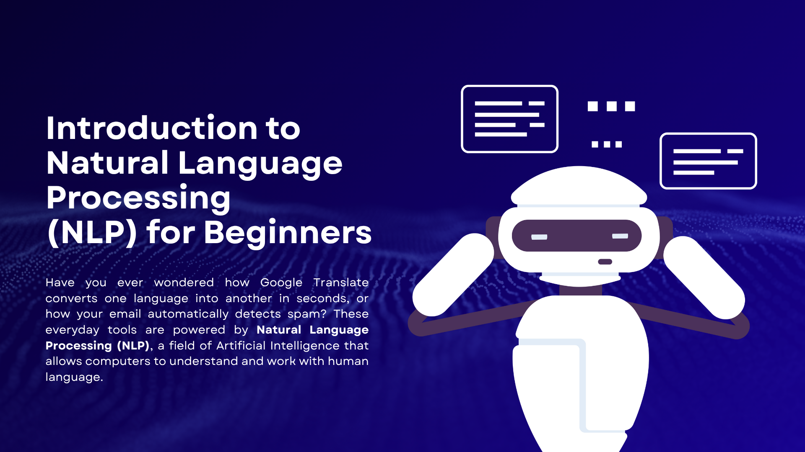

----

# 🤖 Natural Language Processing (NLP) Learning Journey

This repository contains my notes, experiments, and projects as I learn **Natural Language Processing (NLP)**.  
It covers essential techniques and practical implementations that help machines understand and process human language.

---

## 📘 What I'm Learning

- Text preprocessing (cleaning, tokenization, stopword removal)  
- Stemming and lemmatization  
- Bag of Words and TF-IDF  
- N-grams and word frequency analysis  
- Sentiment analysis  
- Named Entity Recognition (NER)  
- Text classification using Machine Learning  
- Word embeddings (Word2Vec, GloVe)  
- Introduction to Transformers and LLMs  

---

## 🧩 Tools & Libraries

- Python  
- NLTK  
- spaCy  
- Scikit-learn  
- Pandas, NumPy  
- Matplotlib, Seaborn  
- Hugging Face (Transformers)

---

## 🚀 Goal

To build a strong foundation in NLP and apply these techniques in real-world projects such as:  
- Sentiment analysis  
- Text summarization  
- Chatbot development  

---

## 🌟 Author

**Hasnain Yaqoob**  
Beginner AI Engineer | Learning NLP and AI.

📧 **Contact** 
[**LinkedIn**](https://www.linkedin.com/in/hasnainyaqoob)
    

